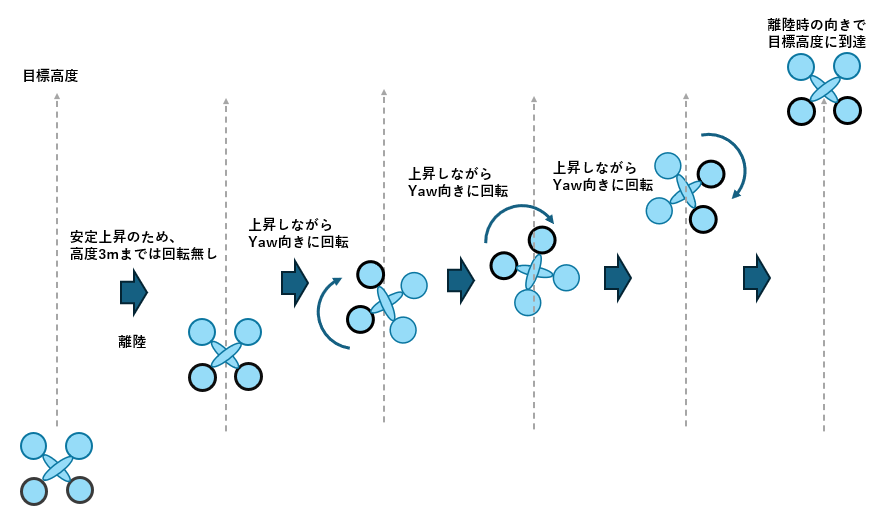

# Pymavlink ドローン制御プログラム 説明ドキュメント

---

## 目次

1. [目的・背景](#1-目的背景)
2. [動作の説明](#2-動作の説明)
3. [処理の流れ](#3-処理の流れ)
4. [シミュレーション結果](#4-シミュレーション結果)
5. [その他](#5-その他)
---

## 1. 目的・背景

### このプログラムが何をするものか

- ArduPilot を搭載したドローンを **Pymavlink** を使って外部からプログラム制御する
- 離陸後、目標高度に達するまでの上昇中に **Yaw 方向へ 360° 回転** させる
- **Skydio社のSkydio2の自動飛行で、離陸上昇中にYaw方向へ360°回転する飛行がかっこよかったので、プログラムでやってみた**

### なぜ Pymavlink を使うのか

- Mission Planner の GUI 操作では「上昇中に継続的な Yaw 制御」ができない
- Pymavlink を使うことで、**高度・姿勢をリアルタイムに監視しながら** 動的に制御コマンドを送ることができる
- 自動化・再現性のある飛行制御が可能になる

### Mission Planner だけではできない理由

| 操作 | Mission Planner | Pymavlink |
|------|:--------------:|:---------:|
| ウェイポイントでの Yaw 回転 | ✅ 可能 | ✅ 可能 |
| 離陸後・特定高度での Yaw 回転 | ✅ 可能 | ✅ 可能 |
| **上昇中（高度到達前）の Yaw 回転** | ❌ 不可 | ✅ 可能 |
| 高度・姿勢を監視しながらの動的制御 | ❌ 不可 | ✅ 可能 |

- `TAKEOFF` コマンド実行中は FC が高度到達に専念するため、**途中で Yaw コマンドを割り込ませることができない**
- Pymavlink スクリプトであれば、高度をループで監視しながら **同時に Yaw Rate 指令を送り続ける** ことができる

---

## 2. 動作の説明
- このプログラムでは、下記の図のようにドローンがYaw方向に360度回転しながら、目標高度まで、上昇する。
- 高度の低い位置で360度回転が完了しないように、目標高度の設置値から1m当たりの回転角度を計算し、高度を監視しながら回転させる。
- 360度の回転が完了する前に、目標高度に到達した場合は、高度を維持しながら360度の回転まで行う。
- 安全のため、離陸後、高度3m以上になってから回転を開始する。
- 安全のため、120秒のプログラムタイムアウトを設ける。
- 目標高度到達後、5秒間ホバリングして、その後RTLモードでホームポジションに着陸する。

## 3. 処理の流れ
① 初期設定 
↓ 
② 接続・ハートビート待機 
↓ 
③ GUIDED モードに設定 
↓ 
④ ホームポジション確認(GLOBAL_POSITION_INT) 
↓ 
⑤ モーターアーム 
↓ 
⑥ 離陸指示 (MAV_CMD_NAV_TAKEOFF) 
↓ 
⑦ 上昇ループ 
├─ 高度と向き監視(GLOBAL_POSITION_INT)を行いながら、Yaw回転量計算&指示(MAV_CMD_CONDITION_YAW) 
├─ 累積回転量を計算・更新 
├─ 360度回転完了 → Yaw 停止 
└─ 目標高度到達＆360度回転完了でループ終了 
└─タイムアウト(120秒)で終了 
↓ 
⑧ 5秒ホバリング 
↓ 
⑨ RTLモードに変更(MAV_CMD_NAV_RETURN_TO_LAUNCH) 
↓ 
⑩ 下降ループ 
  　高度監視(GLOBAL_POSITION_INT)を行い、高度が0.3m以下になるまで待つ 
↓ 
⑪ 着陸、プログラム終了
 

- 使用したコマンド

| コマンド | 用途 |
|----------|------|
| `MAV_CMD_NAV_TAKEOFF` | 離陸・目標高度まで上昇 |
| `GLOBAL_POSITION_INT` | 位置、高度、向き情報 |
| `MAV_CMD_CONDITION_YAW` | 指定角度へ Yaw 回転 |
| `MAV_CMD_NAV_RETURN_TO_LAUNCH` | RTLモード |

## 4. シミュレーション結果
・目標高度20mの設定で、離陸　→　目標高度到達後に5秒ホバリング　→ RTLモードで着陸

## 5. その他
- 離陸して、Yaw方向に一回転させるだけであるが、制御が難しかった。TAKEOFFコマンドで上昇させているが、上昇スピードがわからないため、単純に回転させるコマンドを送るだけでは、思った通りの動作にならなった。そのため、目標高度から単位高さ当たり回転量を求め、高度を監視しながら回転指示を行うことにした。また、目標高度が低い場合は、かなりの速さで回転させないといけないため、安全面から、目標高度に到達した時に、一回転していなければ、高度保持状態で、残りの回転を行い、プログラム終了とする動作とした。
